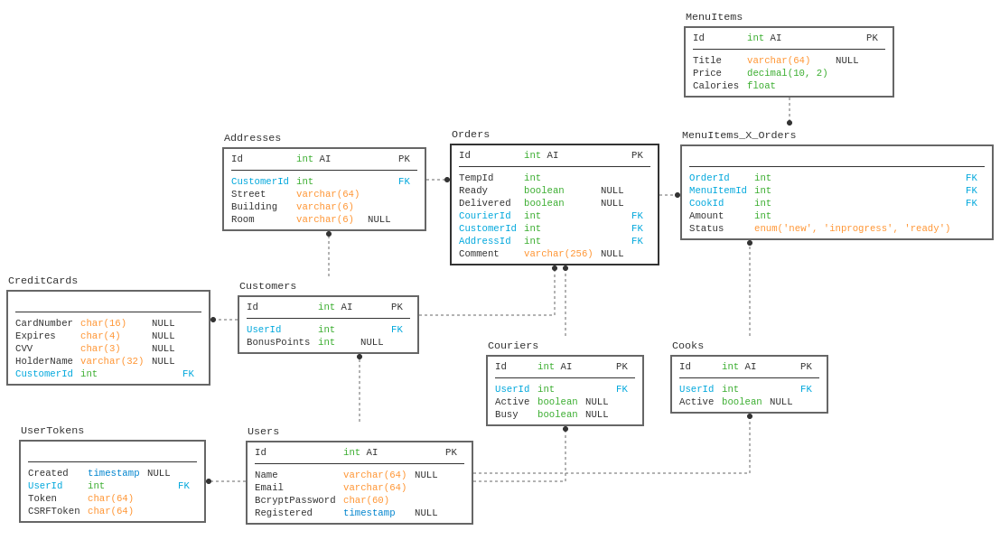
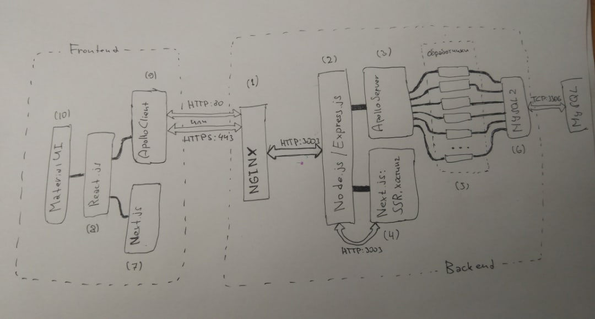

# Система управления работой сервиса по доставке еды

## Что творят пользователи

### Покупатель

1. Регистрируется в приложении;
2. Входит в приложение;
3. Набирает заказ из пунктов меню;
4. Вводит адрес доставки / Выбирает сохраненный адрес;
5. Вводит данные карты / Выбирает сохраненную карту;
6. Ждет курьера.

### Работник ресторана

1. Входит в приложение;
2. Включает режим активности;
3. Пока длится рабочий день:
    1. Ждет пока появится назначенный ему список заказанной еды с номерами заказов;
    2. Для каждого пункта списка:
        1. Помечает пункт готовящимся;
        2. Готовит его, кладет в пакет с номером заказа;
        3. Помечает пункт готовым;
4. Выключает режим активности.

### Курьер

1. Входит в приложение;
2. Включает режим активности;
3. Пока длится рабочий день:
    1. Помечает себя свободным;
    2. Ждет пока ему назначат доставку заказа;
    3. Забирает в ресторане пакет с номером заказа;
    4. Доставляет заказ по адресу;
4. Выключает режим активности.

## Схема базы данных



### Список индексов:

1. `users_by_email` — таблица *Users* по полю *Email*;
2. `tokens_by_tokens` — таблица *UserTokens* по полям *Token* и *CSRFToken*;
3. `orders_by_customers` — таблица *Orders* по полю *CustomerId*;
4. `orders_by_couriers` — таблица *Orders* по полю *CourierId*;
5. `order_items_by_cooks` — таблица *MenuItems_X_Orders* по полю *CookId*.

## Элементы SPA-приложения

### Страницы

1. `/` — Главная | Меню:
    * Если нет авторизации:
        1. Кнопка *Регистрация*;
        2. Кнопка *Вход*;
    * Если осуществлен вход:
        1. Список блюд в меню;
2. `/login` — Вход для покупалетей:
    1. Электронная почта;
    2. Пароль;
    3. Кнопка *Войти*;
3. `/register` — Регистрация для покупателей:
    1. Имя;
    2. Электронная почта;
    3. Пароль;
    4. Кнопка *Зарегистрироваться*;
4. `/profile` — Редактирование профиля пользователя:
    1. Имя;
    2. Электронная почта;
    3. Новый пароль;
    4. Кнопка *Сохранить*;
5. `/history` — История заказов;
6. `/checkout` — Оформление заказа:
    1. Просмотр корзины;
    2. Адрес доставки:
        1. Выбор адреса из сохраненных;
        2. Кнопка добавления нового;
    3. Карта для оплаты:
        1. Выбор карты из сохраненных;
        2. Кнопка добавления новой;
    4. Кнопка *Оплатить*;
7. `/service/cook` — Рабочая страница работника кухни:
    1. Кнопка переключения режима активности: *Начал рабочий день* | *Завершил рабочий день*;
    2. Список задач, для каждой задачи:
        1. Название блюда;
        2. Кнопка *Начать готовить*;
8. `/service/cooking` — Страница готовящегося блюда:
    1. Название блюда;
    2. Номер заказа;
    3. Кнопка *Подготовить к доставке*;
9. `/service/courier` — Рабочая страница курьера:
    1. Кнопка переключения режима активности: *Начал рабочий день* | *Завершил рабочий день*;
    2. Кнопка *Готов забрать заказ*;
    3. Слот назначенного заказа:
        1. Номер заказа;
        2. Кнопка *Забрал заказ*;
10. `/service/delivering` — Страница доставляемого заказа:
    1. Номер заказа;
    2. Адрес доставки;
    3. Кнопка *Доставил заказ*.


### Модальные окна

1. Форма добавления адреса доставки;
2. Форма добавления банковской карты;
3. Сообщение с текстом (Alert);
4. Сообщение с просьбой подтвердить (Confirm).

## Архитектура веб-приложения



* [nginx](https://www.nginx.com/) *(1)*, гибкий веб-сервер, в принципе сам по себе полезная вещь, но мы используем его как [reverse-proxy](https://docs.nginx.com/nginx/admin-guide/web-server/reverse-proxy/) чтобы не работать с HTTPS и SSL-сертификатами вручную, а парой строк конфига делегировать ему это все;
* [Node.js](https://nodejs.org/en/) *(2)* это рантайм JS для сервера, юзаем потому что язык удобный, популярный (следовательно много документации в интернете) и потому что можно юзать одни и те же функции на сервере и клиенте (например валидация email). Сразу поверх ноды юзаем [Express.js](http://expressjs.com/) как основной веб-сервер, потому что это популярная библиотека под ноду и к ней легко прицеплять все остальное;
* [Apollo](https://www.apollographql.com/) Server *(3)* — либа для обработки GraphQL-запросов, мы ей даем схему и функции-обработчики, а она сама дальше разбирается, что делать + там есть GraphiQL для удобной отладки бека. Сам GraphQL юзается вместо традиционного REST API для уменьшения объема написанного кода: меньше кода — меньше багов. Может быть не совсем оправданно для такого маленького проекта, но это учебный проект бла-бла знакомство с технологией;
* [Next.js](https://nextjs.org/) *(4)* на сервере юзается для SSR и хостинга всяких файлов типа картинок, когда делает SSR может делать запросы к основному серверу, чтобы подгрузить данные и вставить их в выдаваемую страницу;
* Функции обработчики действий *(5)* со всякой бизнес-логикой, их вызывает библиотека Apollo Server, а они сами используют:
* Node.js-библиотеку [MySQL2](https://www.npmjs.com/package/mysql2) *(6)* для запросов к MySQL базе данных;
* На фронте тоже работает Next.js *(7)* в основном в качестве роутера;
* Весь интерфейс рендерится реактом *(8)* с кусками [MaterialUI](https://material-ui.com/) *(10)*;
* Для GraphQL-запросов юзается Apollo Client *(9)*.

## Установка и запуск

На MySQL сервере необходимо создать пустую БД `cloud-kitchen`.

Клонируем репу:

```sh
git clone https://github.com/kiraind/cloud-kitchen.git
cd cloud-kitchen
```

Устанавливаем зависимости:

```sh
npm i
```

Инициализируем БД, подставив в переменные окружения параметры входа:

```sh
MYSQL_HOST=localhost MYSQL_USER=username MYSQL_PASSWORD=password123 npm run init-db
```

Запускаем сервер для разработки:

```sh
MYSQL_HOST=localhost MYSQL_USER=username MYSQL_PASSWORD=password123 npm run dev
```

Идем на [localhost:3003](http://localhost:3003/).